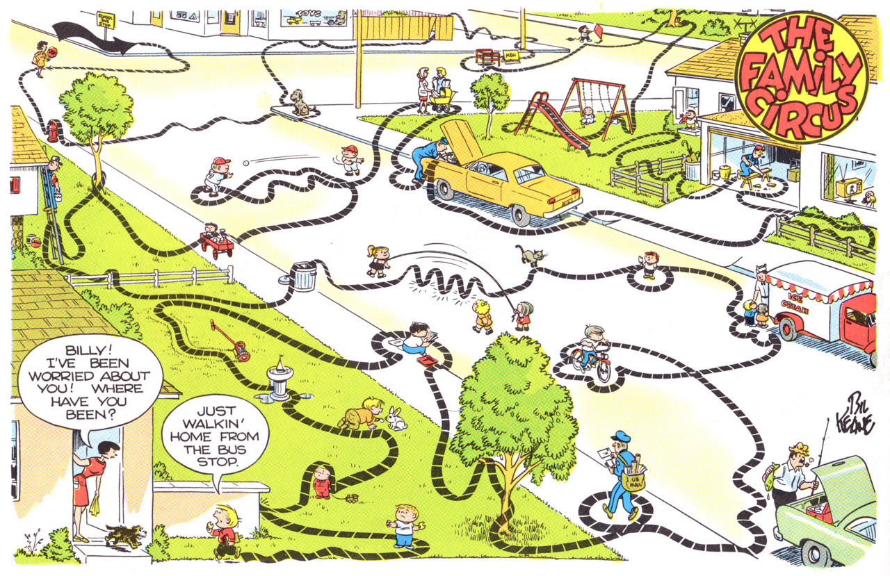
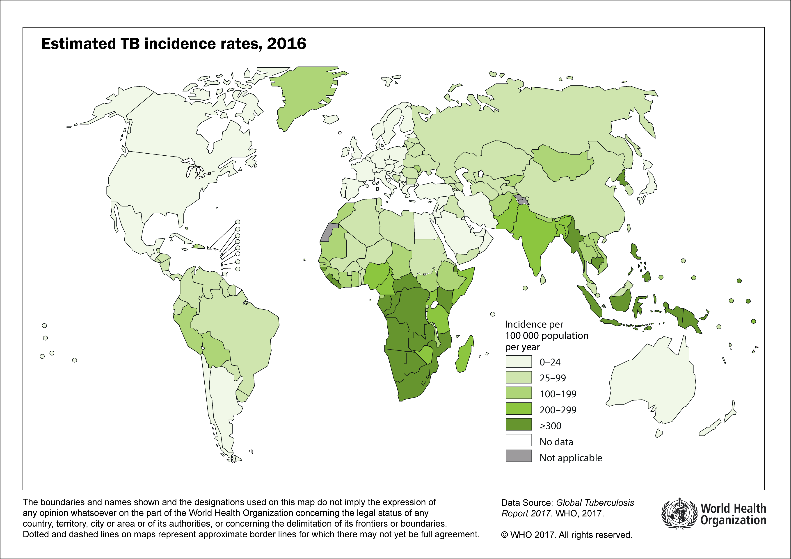
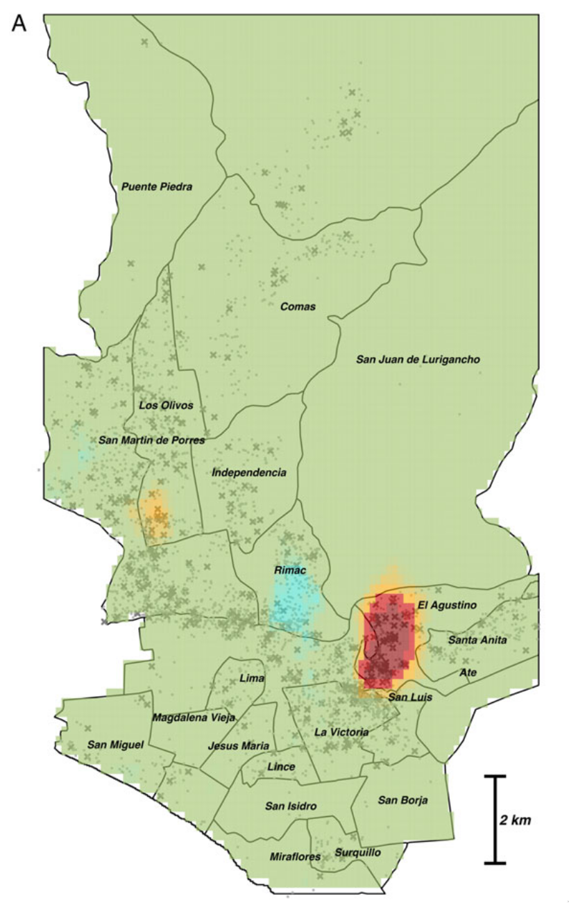
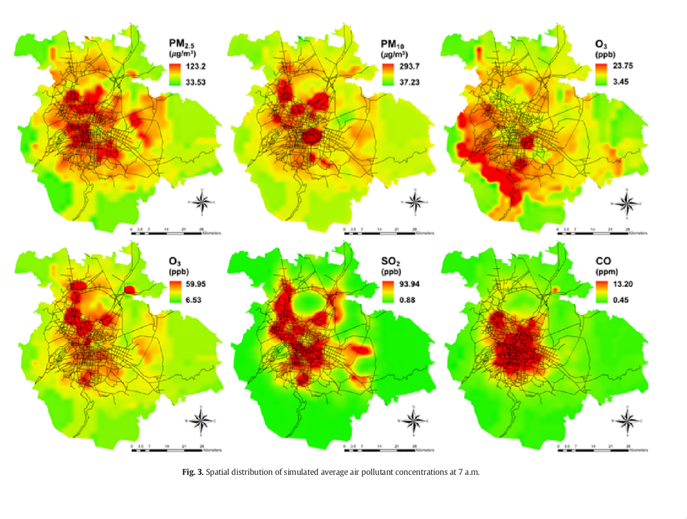
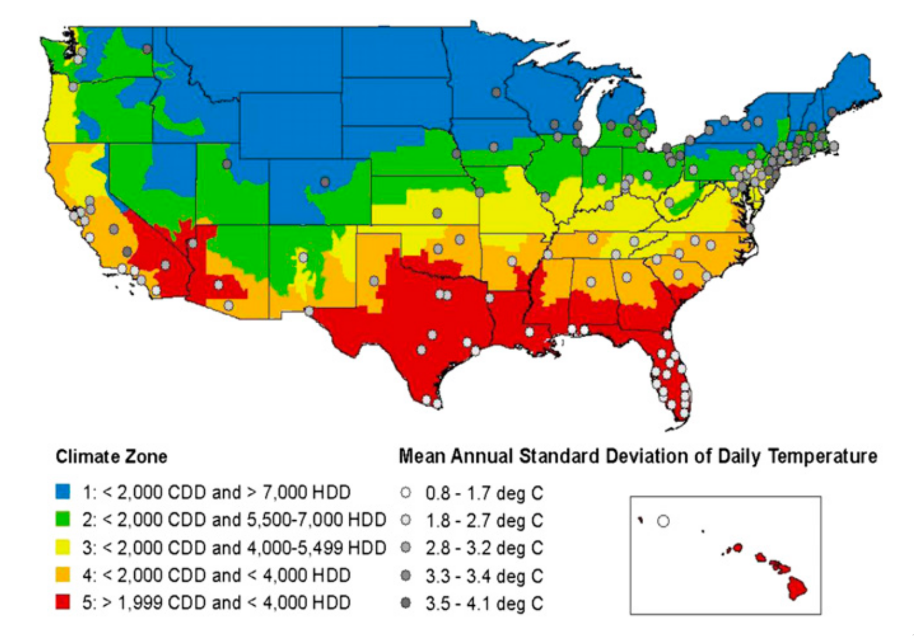
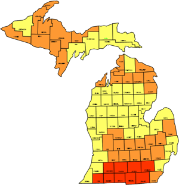

```{r setup, include=FALSE}
require(RefManageR)
require(knitr)
options(htmltools.dir.version = FALSE,
        servr.daemon = TRUE)
knitr::opts_chunk$set(
	echo = FALSE,
	message = FALSE,
	warning = FALSE,
	out.height = 400
)
bib <- ReadBib("~/repos/bibtex-library/jz_library.bib")

```

# Maps can tell a story

.center[

]

---

# Maps can show how places are connected

[Global air travel ✈️](http://www.arcgis.com/apps/OnePane/storytelling_basic/index.html?appid=605204b677894f0da7a1acd83b9ee308&_ga=1.47316964.235754488.1426102017)

---

class: center

# Maps can show how many people live in a place


[Michigan lights at night](https://earth.google.com/web/@43.4712584,-84.36319945,558.95166674a,989657.41508156d,35y,0h,0t,0r/data=CisSKRIgMGY3ZTJkYzdlOGExMTFlNjk5MGQ2ZjgxOGQ2OWE2ZTciBWVhcnRo)

---

# Global Tuberculosis

.center[


]
---

# A whole city

.center[

]

---

# Or just a single neighborhood


---

# They can show things in the environment

.center[

]

---

# They can show things in the environment

.center[

]

---
# Michigan Radon

.center[

]
---


