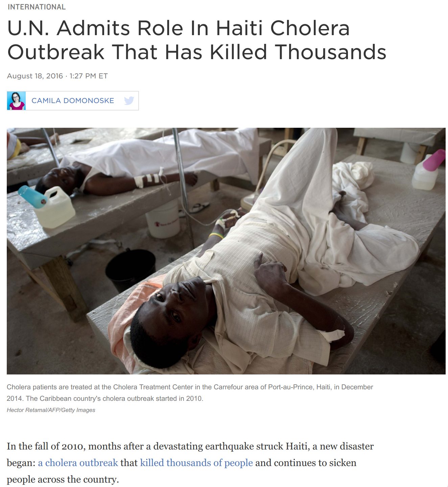

```{r setup, include=FALSE}
require(RefManageR)
require(knitr)
options(htmltools.dir.version = FALSE,
        servr.daemon = TRUE)
knitr::opts_chunk$set(
	echo = FALSE,
	message = FALSE,
	warning = FALSE,
	out.height = 400
)
bib <- ReadBib("~/repos/bibtex-library/jz_library.bib")

```

# How did we get from here...


---

background-image: url('images/broad_street_pump.jpg')
background-position: 50% 50%
class: inverse

# To here?

---

# And here?


---

# Agenda

1. **.large[Some Cholera background.]**

--

2. **.large[John Snow's historical tour of Cholera.]**

--

3. **.large[Using spatial data to make a present-day policy argument.]**


---

background-image: url('images/v_cholerae.jpg')
class: bottom inverse


# Some background on *V. Cholerae*

---

## Cholera transmitted by the fecal-oral pathway

.center[


]

---

## Nested in a complex social-ecological system.
.center[

Image from  `r Citet(bib, "garchitorena2017")`
]

---

## Rice water stool characteristic of Cholera infection

--


---

## Cholera remains an important, but not leading, cause of global morbidity and mortality

```{r echo=FALSE,  fig.cap=paste0(Citet(bib, "ali2015"), " estimate 2.5M annual cases and 95K deaths."), message=FALSE, warning=FALSE}

```

---

## Cholera often appears in the aftermath of disasters

.center[

]

---
class: inverse, middle, center

# John Snow and the "Ghost map"


---

# Science in Action

.center[


]

> "[John Snow] sits alone in his cluttered flat, frogs croaking around him, illuminated only by candlelight. After a few minutes tinkering...he fastens the mouthpiece over his face and releases the gas. Within seconds, his head hits the desk. Then, minutes later, he wakes, consults his watch through blurred vision. He reaches for his pen, and starts recording the data." (From `r Citet(bib,"johnson2007")`)

---

# Science in Action

.center[


]


> "[John Snow] sits alone in his cluttered flat, frogs croaking around him, illuminated only by candlelight. After a few minutes tinkering...he fastens the mouthpiece over his face and releases the gas. Within seconds, his head hits the desk. Then, minutes later, he wakes, consults his watch through blurred vision. He reaches for his pen, and starts recording the data." 

---
class: inverse

## The foul quality of London's water was well-known


*An 1828 cartoon courtesy of The British Museum*
---


## Building the case for the water supply 

.pull-left[
- Snow noticed that different neighborhoods were likely to have differential exposure to .alert[wastewater] based on their geographic position in the city and water supplier.


- Consulted tables from the city of London and found that the per-capita Cholera death rate .alert[south] of the Thames was 8/1000, approx 3x more than the city as a whole.

]

.pull-right[


*Cholera deaths by district of London in 1832 outbreak*

]

---

class: middle

## Consistency .alert[across spatial scales] is the centerpiece of Snow's argument

.pull-left[
> "Whether you looked at the evidence on the scale of an urban courtyard or on the scale of entire city neighborhoods, the same pattern repeated itself: the cholera seemed to segment itself around .alert[shared water supplies]." (Johnson, p.74)
]

.pull-right[


]

---

# Snow's Grand Experiment

- Take advantage of changes in infrastructure to compare neighborhoods served with contaminated and clean water.

--

- Focused on understanding the causes of .alert[endemic] cholera in London

--

- Example of a natural experiment.

--

## What is a natural experiment?

- Exploits some kind of random variation in exposure to make causal inferences where they would otherwise not be possible. 

--

- What are some other potential examples?

---

## Changes in London water service provided an opportunity 

- Around 1850, parliament mandated that all water companies move their intake beyond the outflow of the Thames by 1855.

--

.pull-left[

- In south London there were two major water suppliers: Southwark & Vauxhall (S&V) and Lambeth.

- Lambeth moved the intake up in .1852, but S&V waited until .red[1855].
 
]

.pull-right[


]


---

## Snow took advantage of spatial differences in .alert[exposure]
.pull-left[


]

.pull-right[
- Snow divided data into sub-districts of South London organized by water supplier.

- 12 were served by only S&V, 3 by Lambeth alone

- 1/100 people died of Cholera in .alert[S&V only] districts, but none among the > 14K Lambeth districts
]
---

## A wrinkle in the Grand Experiment...
.middle[

.pull-left[

- But: 16 sub-districts were served by both suppliers

- Within these districts, water service was overlapping at a fine scale.

- Population data were not available at a fine enough scale to figure out who was at risk and where.

]

.pull-right[


Image from `r Citet(bib,"koch2006")`

]

]

---

## If Snow didn't end the outbreak by getting the handle removed, was his work important?
--
.center[


*1856 cartoon illustrating an infected water pump as "death's dispensary".*
]
---
class: inverse

# Lessons of 1854 outbreak are about *scale* from the bottom to the top.

<iframe width="1000" height="450" src="https://www.youtube.com/embed/0fKBhvDjuy0" frameborder="0" allow="accelerometer; autoplay; encrypted-media; gyroscope; picture-in-picture" allowfullscreen></iframe>

---

class: inverse, middle, center

# Using spatial data to make policy and practice arguments 

---

## Discussion Questions

1. What .alert[scales] of surveillance and intervention are  important for achieving global Cholera elimination?

--

2. Which of the proposed interventions have a spatial component?

--

3. What is the rationale behind targeting hotspot areas?

--

4. What challenges or risks might be associated with the hotspot-focused approach?

---

## .red[Hotspots] are at the center of the global roadmap

.center[


*But what is a hotspot, anyway?*

]
---

# Next Time

---

# References

```{r, results="asis"}
PrintBibliography(bib)
```

