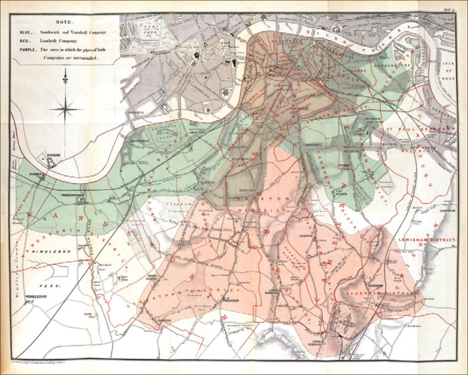

```{r setup, include=FALSE}
require(RefManageR)
require(knitr)
options(htmltools.dir.version = FALSE,
        servr.daemon = TRUE)
knitr::opts_chunk$set(
	echo = FALSE,
	message = FALSE,
	warning = FALSE,
	out.height = 400
)
bib <- ReadBib("~/repos/bibtex-library/jz_library.bib")

```

# How did we get from here...


---

background-image: url('images/broad_street_pump.jpg')
background-position: 50% 50%
class: inverse

# To here?

---

# And here?
.center[

]

---

# Agenda

1. Some Cholera background.

--

2. A historical tour of London's Cholera epoidemics with John Snow.

--

3. How is spatial data used to make the case for policy and practice in the present day?


---

# Scale...on a grand scale.
___

<iframe width="1000" height="450" src="https://www.youtube.com/embed/0fKBhvDjuy0" frameborder="0" allow="accelerometer; autoplay; encrypted-media; gyroscope; picture-in-picture" allowfullscreen></iframe>
---

background-image: url('images/v_cholerae.jpg')
class: bottom inverse


# Some background on *V. Cholerae*

---

## Cholera transmitted by the fecal-oral pathway

.center[


]

---

# These environmental systems are part of a complex social-ecological web.


.center[Image from  `r Citet(bib, "garchitorena2017")`]

---

# Rice water stool characteristic of Cholera infection

.center[


What makes this so deadly?

]

---

# Cholera remains an important cause of global morbidity and mortality

```{r echo=FALSE,  fig.cap=paste0(Citet(bib, "ali2015"), " estimate 2.5M annual cases and 95K deaths."), message=FALSE, warning=FALSE}
knitr::include_graphics("images/global_cholera_ali_2015.png")
```

---

# We are currently in the .alert[seventh] global cholera pandemic

.center[


Map of dissemination of current pandemic strain. Figure from `r Cite(bib, "hu2016")`

]

---

# Cholera often appears in the aftermath of disasters

.center[

]

---
class: inverse, middle, center

# John Snow and the "Ghost map"


---

# How was the case made for the role of water in the 1854 London Cholera outbreak?

Reflecting on "Sick City":

1. What were the relevant .alert[spatial scales] of analysis for making the argument?

--

2. What made .alert[miasma] theory so hard to dislodge, even in the face of strong evidene?

--

3. Did snow work alone? Who else helped develop his theory?

--

4. What are some more-recent analogues of miasma theory?

---

# Science in Action

.center[


]

> "[John Snow] sits alone in his cluttered flat, frogs croaking around him, illuminated only by candlelight. After a few minutes tinkering...he fastens the mouthpiece over his face and releases the gas. Within seconds, his head hits the desk. Then, minutes later, he wakes, consults his watch through blurred vision. He reaches for his pen, and starts recording the data." (From `r Citet(bib,"johnson2007")`)

---

# Science in Action

.center[


]


> "[John Snow] sits alone in his cluttered flat, frogs croaking around him, illuminated only by candlelight. After a few minutes tinkering...he fastens the mouthpiece over his face and releases the gas. Within seconds, his head hits the desk. Then, minutes later, he wakes, consults his watch through blurred vision. He reaches for his pen, and starts recording the data." 

---


## The foul quality of London's water was well-known

.center[


*An 1828 cartoon courtesy of The British Museum*

]


---

# Broad Street outbreak was a small part of the .alert[Third Cholera Pandemic]

Preceded by Second Global Cholera pandemic:

.center[


Map of cholera dissemination from `r Cite(bib, "daude2008")`
]
---

class: middle

# Consistency .alert[across spatial scales] is the centerpiece of Snow's argument

.pull-left[
 "Whether you looked at the evidence on the scale of an urban courtyard or on the scale of entire city neighborhoods, the same pattern repeated itself: the cholera seemed to segment itself around .alert[shared water supplies]." (Johnson, p.74)
]

.pull-right[


]

---

# Legal change provided an opportunity 

- Around 1850, parliament mandated that all water companies move their intake beyond the outflow of the Thames by 1855.

--

.pull-left[

- In south London there were two major water suppliers: Southwark & Vauxhall (S&V) and Lambeth.

- Lambeth moved the intake up in 1852, but S&V waited until .red[1855].
 
]

.pull-right[


]


---

# Snow took advantage of  spatial differences in .alert[exposure] to conduct a natural experiment

- Partitioned death register data into sub-districts of South London organized by water supplier.

--

- 12 were served by only S&V, 3 by Lambeth alone.

--

- 1/100 people died of Cholera in .alert[S&V only] districts, but none among the > 14K Lambeth districts.

---

#  A wrinkle in the Grand Experiment

.pull-left[

.middle[
- 16 sub-districts were served by both suppliers

- Within these districts, water service was overlapping at a fine scale.

- Population data were not granular enough to figure out who was at risk and where.

- Should thisimpact our evaluation of his results?
]
]

.pull-right[


 Image from `r Cite(bib,"koch2006")`

]


---

## If Snow didn't end the outbreak by getting the handle removed, was his work important?
--
.center[


*1856 cartoon illustrating an infected water pump as "death's dispensary".*
]
---


class: inverse

# How is spatial data used to make policy and practice arguments?

.center[

]


---

# Using spatial data to make global Cholera policy.

.pull-left[
1. What .alert[spatial scales] of surveillance and intervention are important for achieving global Cholera elimination?

2. What is the .alert[mechanistic] role of space? Social?

3. Which of the proposed interventions have a spatial component?

4. What challenges or risks might be associated with their recommended approach?
]

.pull-right[

]
---

# A spatial approach to TB in New York

.pull-left[
1. What is the overarching goal of the TB control program in NYC?

2. What are the relevant spatial scales employed in this report?

3. Is .alert[spatial relatedness], e.g. through contagion, the primary concern, or is it something else?

4. How do they use this information to show how they are/are not meeting their goals?
]

.pull-right[
  .middle[]
]
---

# Next Time

## Readings

A glossary of concepts/terms for spatial epidemiology:

[`r Citet(bib, "rezaeian2007")`](https://drive.google.com/file/d/1hg7VZgkCbOCoVnViIYPUtJOelRkXDfOp/view?usp=sharing)

A broad overview of .alert[health and medical geography]:

[`r Citet(bib, "emch2017")`](https://drive.google.com/file/d/1-2wFyqJbD7v7zu_AlTO2_xQeK5vdD1hc/view?usp=sharing)


---

# References

```{r, results="asis"}
PrintBibliography(bib, start = 1, end = 4)
```

---

# References

```{r, results="asis"}
PrintBibliography(bib, start = 5)
```

