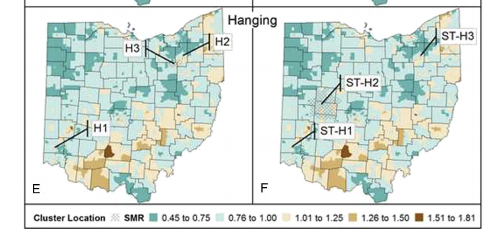

```{r setup, include=FALSE}
require(RefManageR)
require(knitr)
options(htmltools.dir.version = FALSE,
        servr.daemon = TRUE)

knitr::opts_chunk$set(
	echo = FALSE,
	message = FALSE,
	warning = FALSE,
	out.height = 400
)
bib <- ReadBib("~/repos/bibtex-library/jz_library.bib")

```

class: inverse middle center

# What does it mean to *do* spatial analysis?
---

# Agenda

- Review .alert[semester agenda] responses

--

- Emch and Rezaien readings activity

--

- Some orienting .alert[notation]

--

- A motivating .alert[example]

---

class: middle center inverse

# Semester Agenda themes

---

# Topic areas

.pull-left[

- Physical environment (e.g. .green[greenspace]) and health

- Global and domestic health inequality

- Social/ecological/nutrition relationships.
]

.pull-right[

- Spatial/contextual effects on cognitive outcomes for older adults.

- Uveitis (👁 inflammation) outcomes.

- Water, sanitation, hygiene: 🚱 to 🚰.

]

---

# Conceptual areas

- How do you identify a good/answerable spatial question?

- How to conduct a spatial analysis?

- What types of .alert[data] are used in spatial analysis?

- How do you pick the right level of scale for analysis?

- What do you do when there is a .alert[mismatch] between your question and the available data?

- Cross-cultural modeling in a healthcare context.

---

# Methodological goals

- Relationships between spatial and temporal correlation.

- Relate system .alert[dynamics] to spatial patterns.

- Spatial .alert[exposure] assessment via "local regression" (e.g. smoothing) approaches.

- Use spatial data to prioritize/target medical intervention.

- Find and assess significance of disease .alert[clusters].

- Spatial data presentation/visualization.

---

class: inverse center middle

# Tools of the trade

---

# What .alert[tools] and .alert[problems] do Rezaien et al. identify?

--

1. Geographic Information System

--

2. GPS

--

3. Smoothing

--

4. Spatial autocorrelation/dependence

--

5. Spatial regression

---

# Why would we want to .alert[smooth] spatial data?

--
.center[



Smoothed areal suicide data from `r Cite(bib, "fontanella2018")`.

]

---

# Big ideas from Emch & Root

1. What is the long and complex history of ecology in epdiemiology all about?

--

2. Is all ecological research necessarily subject to the dreaded .red[ecological fallacy]? Why or why not?

--

3. "If it can't be mapped, it's not geography.": What do we think?

---

# Health in Context


##"States of health or disease are the expressions of the success or failure experienced by the organism in its efforts to respond adaptively to environmental challenges." (From `r Cite(bib, "dubos1969")`)

---


# What aspects of the readings is most relevant to your interests/project?

Reflecting on the Emch and Rezaien readings:

Alone:

1. Identify the .alert[concepts] in the Emch & Root chapter most relevant to your personal/academic/project interests.

--

In pairs:

2. If you had to characterize what you'd like to do for your final project, what would you say?
--

3. Identify the .alert[tools] in Rezaien that would help you best address these.

--

4. What do you think is .alert[realistic] to try to do in the span of a semester?

---

class: inverse center middle

# Notes on *notation*

---
class: center middle

# Why should we care about notation, anyway?

---

# Bookkeeping

We will adopt the hierarchical modeling notation used in `r Cite(bib, "gelman2006")`.

### Indices let us keep track of what needs tracking:

- $i$ indexes *individuals*.

--

- $j$ indexes *spatial units*.

--

- $t$ indexes *time*.

--

### Counts let us know how much of everything we're dealing with:

- $J$ is the number of spatial locations.

--

- $n_j$ is the number of individuals in location $j$


---

# Put them together!

.center[

*Counts* and *indices* go together like peas and 🥕 !
]

---

# Indices let us access what we need

- $y_{ij}$ is outcome for individual $i$ in unit $j$.
  - Where: $i\in\{1,\ldots,n_j\}$ ( $\in$ means "in")
  
  - And: $j\in\{1,\ldots,J\}$
  
--

- $x_{ij}$ is a .alert[covariate] associated with individual $ij$.

--

- $u_j$ is a covariate for .alert[location] $j$

---

# But what about data?

- If our data, $y$, have a Normal distribution

- With mean $\mu$ = 0,

- And variance $\sigma^2$,

- We can write: $y\sim\mathcal{N}(0,\sigma^2)$

---

# But I thought we were going to talk about .alert[models]?

.pull-left[

- If $y_{ij}$ has a Normal distribution,

- We can write $y_{ij}\sim\mathcal{N}(\mu_{ij},\sigma_{y}^2)$

- Where $\mu_{ij}$ is a function of covariates, eg:

- $\mu_{ij}=\alpha_j+\beta x_{ij}$

- And $\alpha_{j}\sim\mathcal{N}(\mu_{j},\sigma_{\alpha}^{2})$

]

.pull-right[

```{r, fig.cap="Normally distributed outcome"}
require(ggplot2)
x <- rnorm(1000)
df <- data.frame(x=x, y=1:100)
g <- ggplot(df, aes(x = x)) + geom_histogram() + theme_bw()
plot(g)
```
]

---

# Next Time

When the 🏎️meets the road..some actual multi-level analysis!

```{r, results="asis"}
bib["merlo2005"]
```

And:

```{r, results="asis"}
bib["roux2001"]
```

--

- Come to class prepared for a hands-on activity.

---

# References

```{r, results="asis"}
PrintBibliography(bib, start = 1, end = 4)
```


