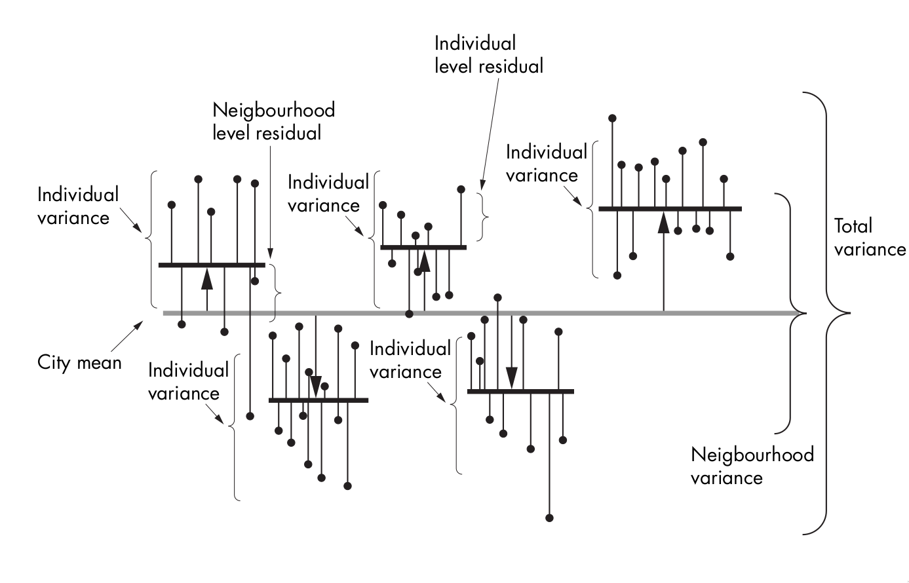
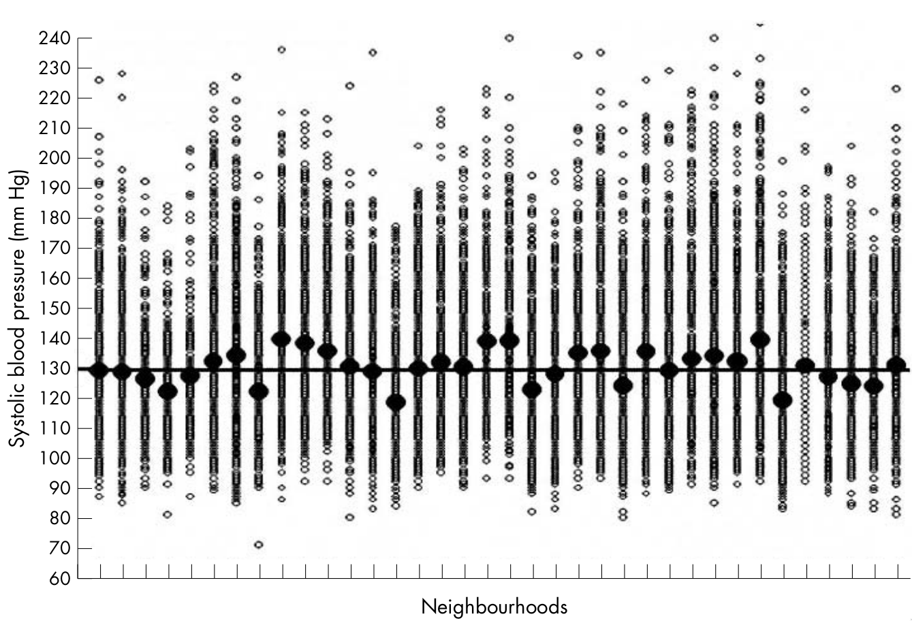

```{r setup, include=FALSE}
require(RefManageR)
require(knitr)
options(htmltools.dir.version = FALSE,
        servr.daemon = TRUE)

knitr::opts_chunk$set(
	echo = FALSE,
	message = FALSE,
	warning = FALSE,
	out.height = 400
)
bib <- ReadBib("~/repos/bibtex-library/jz_library.bib")

```


class: inverse middle center

# Where the rubber meets the road...
---

# Agenda

- Some notes on .alert[notation]

--

- Brief review of Merlo et al.

--

- Hands-on intraclass correlation activity.

---

class: inverse center middle

# Notes on *notation*

---
class: center middle

# Why should we care about notation, anyway?

---

# Bookkeeping

We will adopt the hierarchical modeling notation used in `r Cite(bib, "gelman2006")`.

### Indices let us keep track of what needs tracking:

- $i$ indexes *individuals*.

--

- $j$ indexes *spatial units*.

--

- $t$ indexes *time*.

--

### Counts let us know how much of everything we're dealing with:

- $J$ is the number of spatial locations.

--

- $n_j$ is the number of individuals in location $j$


---

# Put them together!

.center[

*Counts* and *indices* go together like peas and 🥕 !
]

---

# Indices let us access what we need

- $y_{ij}$ is outcome for individual $i$ in unit $j$.
  - Where: $i\in\{1,\ldots,n_j\}$ ( $\in$ means "in")
  
  - And: $j\in\{1,\ldots,J\}$
  
--

- $x_{ij}$ is a .alert[covariate] associated with individual $ij$.

--

- $u_j$ is a covariate for .alert[location] $j$

---

# But what about data?

- If our data, $y$, have a Normal distribution

- With mean $\mu$ = 0,

- And variance $\sigma^2$,

- We can write: $y\sim\mathcal{N}(0,\sigma^2)$

---

# I thought we were going to talk about .alert[models]?

.pull-left[

- If $y_{ij}$ has a Normal distribution,

- We can write $y_{ij}\sim\mathcal{N}(\mu_{ij},\sigma_{y}^2)$

- Where $\mu_{ij}$ is a function of covariates, eg:

- $\mu_{ij}=\alpha_j+{\beta}x_{ij}$

- And $\alpha_{j}\sim\mathcal{N}(\mu_{j},\sigma_{\alpha}^{2})$

]

.pull-right[

```{r, fig.cap="Normally distributed outcome"}
require(ggplot2)
x <- rnorm(1000)
df <- data.frame(x=x, y=1:100)
g <- ggplot(df, aes(x = x)) + geom_histogram() + theme_bw()
plot(g)
```
]

---

class: center middle inverse

# Understanding intraclass correlation using simulated data.

---

# What do we do when our data show meaningful individual-level and spatial variation?

.center[



Neighborhood and individual-level variation in simulated SBP.

]

---


# Hypothetical data provide a clean example

Merlo et al simulate  and analyze systolic blood pressure (SBP) data for:

- 25,000 people 

- Living in 39 neighborhoods of a hypothetical city

--

- They assume that variation arises from *individual* and *neighborhood* level variation.

--

- Deviations from *population* mean are assumed to be *normally distributed* for both.

---

# The simulated data by neighborhood

.center[



Simulated Systolic Blood Pressure Data. Solid dots = neighborhood sample means; open circles = individual observations. (Figure from `r Cite(bib, "merlo2005")`)

]

---

# Merlo et al. analyze these data with an 'empty' model 

- What makes this .alert[empty]?

--

- Multilevel regression model is typically focused on explaining variance in an outcome, $Y$, using inputs, $X$.

--

- This analysis takes a step back and focuses on estimating how much of the *total variation* in $Y$ is occurring at the .alert[neighborhood] vs .alert[individual] level. 

---

# The empty model defined

$$SBP_{I}=SBP_{C}+E_{N-c}+E_{I-c}$$

- $SBP_{I}$ = SBP for individual I

- $SBP_{C}$ = City mean SBP

- $E_{N-c}$ = difference between neighborhood mean and city mean SBP

- $E_{I-c}$ = difference between individual and neighborhood mean. 


---

# What is variance?

--

- .alert[Square] of the average deviation from the mean

--

- So, if standard deviation, $\sigma$ = 10, Variance, $\sigma^2$ = 100.

--

- Merlo et al. denote $\sigma^2$ as V, but we're going to dispense with that.

---

# Some better notation for the empty model

$$y_{i} =\alpha+\epsilon_{j}+\epsilon_{i}$$

- $y_{i}$ = SBP for individual $i$

--

- $\alpha$ = City mean SBP

--

- $\epsilon_{j}$ = difference between neighborhood $j$ mean and city mean SBP

--

- $\epsilon_{i}$ = difference between individual and neighborhood mean. 

---

# Partitioning the total variance

Merlo et al. show that we can estimate the .alert[total variance] as:

$$\sigma^2_{Total}=\sigma^2_N+\sigma^2_I$$

- $\sigma^2_N$ = .alert[Between-neighborhood] variability in outcomes.

- $\sigma^2_I$ = Individual level variability in outcomes (.alert[within-neighborhood] variation)

--

- We can do this because the variance of any two independent RVs is just the sum of their variances. 

---

# Why would we want to do this?

--

- Figure out what levels accounts for meaningful variation in the data.


- Measure this using intraclass-correlation (ICC):

$$ICC=\frac{\sigma_{N}^2}{\sigma_{N}^2+\sigma_{I}^2}$$

---

class: inverse middle

# Now let's give it a try...


```{r echo=TRUE, warning=FALSE}
n <- floor(25000/39)
neighborhood <- rnorm(39, 130.2, sqrt(36.2))
all_vals <- c()
for (i in 1:39) {
  all_vals <- c(all_vals, neighborhood[i] + rnorm(n, 0, sqrt(433.4)))
}
```

.center[
  Re-generating the simulated data in *R*
  ]


---

# Start your engines

This link will take you to a preloaded *RStudio Cloud* workspace where we can continue:

https://rstudio.cloud/project/843431


---

# Next Time

We will discuss the real-world application of the ICC approach:

```{r, results="asis"}
bib["roux2001"]
```

--

And look at a more in-depth treatment of *neighborhood effects* on health.
---

# References

```{r, results="asis"}
PrintBibliography(bib, start = 1, end = 4)
```
