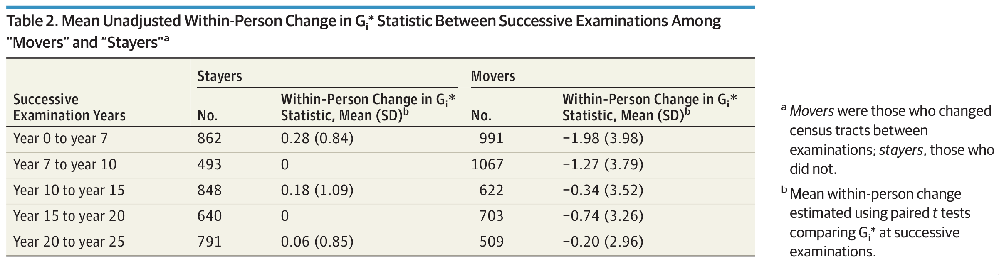

```{r setup, include=FALSE}
require(RefManageR)
require(knitr)
options(htmltools.dir.version = FALSE,
        servr.daemon = TRUE)

knitr::opts_chunk$set(
	echo = FALSE,
	message = FALSE,
	warning = FALSE,
	out.height = 400
)
bib <- ReadBib("~/repos/bibtex-library/jz_library.bib")

```

# Agenda

- Finish hands-on activity

--

- How is .alert[residential segregation] related to health outcomes?

--

- Discussion of Williams and Kershaw articles.

---

class: inverse center middle

# ICC, continued...

This link will take you to a preloaded *RStudio Cloud* workspace where we can continue:

https://rstudio.cloud/project/843431


---

class: inverse center middle

# How does segregation impact health outcomes & inequality?

---

# What is .alert[residential segregation]?

--

According to `r Citet(bib, "massey1988")` segregation is characterized by five dimensions:

1. .alert[Evennness]:
--
Differential distribution of social groups *across areal units* of a city.
--
2. .alert[Exposure]: 
--
Degree of potential contact or possibility of interaction between majority and minority members *within* areas of a city. 
--
3. .alert[Concentration]:
--
Relative amount of *physical space* occupied by a minority group in the urban environment.
--
4. .alert[Centralization]:
--
Degree to which a group is spatially located near the *center of an urban area*.
--
5. .alert[Clustering]:
-- 
Extent to which areal units inhabited by minority members *adjoin* one another in space.

---

# Wjat .alert[mechanisms] link segregation to disparate health outcomes?

- What does each of the categories above potentially contribute to health disparities?

--

- Drawing on the piece by Williams, what is important that may not be captured by this kind of metric?

--

- What other deficiencies do you see in relating segregation to health outcomes?

--

- Can this framework be applied productively outside of the U.S.?

---

# What does segregation .alert[*do*]?

- `r Citet(bib, "williams2001")` describe segregation as a .alert[fundamental cause] of health inequalities. Why might this be?

--

- Segregation places individuals and populations *at risk of risk*.

--

- This suggests that interventions that only address *proximal* factors associated with segregation are less likely to be successful than those that target *upstream* determinants.

---

# Measuring the impact of individual residential segregation exposure on cardiovascular disease outcomes

- `r Citet(bib, "kershaw2017")` use data from the CARDIA study to look at the impact of residential context on .alert[systolic blood pressure].

--

- Longitudinal data from 2280 black participants of a cohort study taking place in 4 cities. 

--

- Used neighborhood-level intensity of exposure to segregation was an input to the model.

--

- Measured local variation in segregation using the Getis-Ord $G_i^*$ statistic.

--

- What is .alert[novel/interesting] about their approach?

---

# Getis-Ord $G_i$ measures local variation in .alert[clustering]

- $G_i$ is the predecessor to $G_i^*$. Captures the same basic idea but is a bit more intutive.

--

- What information relevant to cardiovascular disease might be summarized by this type of measure? 

--

- Measure uses information on the area surrounding a given location to estimate local intensity.

---

# Getis-Ord $G_i$

$$G_{i}(d)=\frac{\sum_{j}w_{ij}(d)x_j}{\sum_{j}x_j}$$

Where:

- $d$ is the maximum distance to consider clustering 
- $w_{ij}(d)=1$ ifplace $i$ and place $j$ are within $d$ of each other, and 0 otherwise. (When $i=j$, $w_{ij}=0$)
- $x_j$ is the variable of interest

---
class: center

# Lets us go from this...


Tordnado incidence from `r Citet(bib, "frazier2019")`

---
class: center

# To this...


Tordnado hot and cold spots identified in `r Citet(bib, "frazier2019")`

---

# Long-term cohort design allows study of .alert[within-person] changes in exposure to segregation



---

# Changes in intensity of segregation associated with increases in SBP


---

# .alert[Moving] from high to lower-segregation context associated with *decreased*  SBP


.center[
$G_i^*<0$ = Low segregation, $0,1.96$ = Medium, $>1.96$ = High Segregation
]

---
# Next Time

Relating residential segregation to .alert[infectious disease] outcomes:

1. [`r Citet(bib, "acevedo-garcia2000")`](https://drive.google.com/open?id=1-HUHXc_UdKg2YNIAAqknZUeSk7YrFYZX&authuser=jzelner@umich.edu&usp=drive_fs)
2. [`r Citet(bib, "biello2012")`](https://drive.google.com/open?id=1-EfFdD-MPuo-9YBTXL5Ss4D1ld9YrKhA&authuser=jzelner@umich.edu&usp=drive_fs)
3. [`r Citet(bib, "niccolai2019")`](https://drive.google.com/open?id=1-EC8KkaEFEJocvNhD9-Bb_896RrocIuS&authuser=jzelner@umich.edu&usp=drive_fs)

---

# References

```{r, results="asis"}
PrintBibliography(bib, start = 1, end = 4)
```
---
# References

```{r, results="asis"}
PrintBibliography(bib, start = 5)
```
