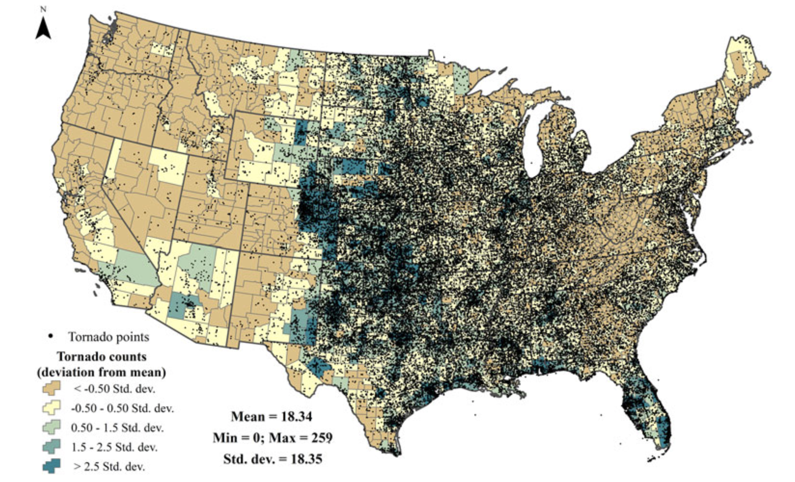

```{r setup, include=FALSE}
require(RefManageR)
require(knitr)
options(htmltools.dir.version = FALSE,
        servr.daemon = TRUE)

knitr::opts_chunk$set(
	echo = FALSE,
	message = FALSE,
	warning = FALSE,
	out.height = 400
)
bib <- ReadBib("~/repos/bibtex-library/jz_library.bib")

```

# Agenda

* A cross-national comparison of segregation and low birthweight risk.

--

* Scaling from local to population-level metrics

--

* Isolating causal impacts of segregation on individual SBP using longitudinal data.

---

class: inverse center middle

# How does segregation impact health non-communicable disease outcomes?

---

# What does segregation .alert[*do*]?

- `r Citet(bib, "williams2001")` describe segregation as a .alert[fundamental cause] of health inequalities. Why might this be?

--

- Segregation places individuals and populations *at risk of risk*.

--

- This suggests that interventions that only address *proximal* factors associated with segregation are less likely to be successful than those that target *upstream* determinants.

---

class: inverse center  middle

# Cross-national comparison of segregation and low birthweight

---

# How does the impact of segregation vary by national context?

1. Why did they choose Chicago and Toronto for this study?

--

2. How do DeMaio et all operationalize the notion of segregation in Toronto and Chicago?

--

3. How does the impact of residential segregation on LBW vary between Chicago and Toronto?

--

4. What does it mean that the Chicago models explained more of the variation in LBW outcomes than the Toronto ones?

--

5. What would you critique about this study and its conclusions?

---

# Relationships between community composition and LBW outcomes

.center[


]
---

# Relationship between percent minority and LBW percentage

.center[


]
---

# Relationship between percent black and LBW percentage
.center[


]

---

# Percent minority $\approx$ Isolation?

Isolation can be calculated as:

$$
\sum_{i}^{n}\left[\left(\frac{x_i}{X}\right)\left(\frac{x_i}{t_i}\right)\right]
$$
Where:

- $x_i$ = Number of minority group members in area $i$.

--

- $X$ = Total number of minority members

--

- $t_i$ = Total population of area $i$.

---

# What's missing from this picture?

--
.center[
```{r}
require(dplyr)
require(ggplot2)
require(spdep)

## Make an empty matrix
d <- 24
neighborhood_mat <- matrix(0, d, d)
neighborhood_mat[1:length(neighborhood_mat)] <- runif(length(neighborhood_mat), 0.01, 0.2)

neighborhood_mat[,1:floor(d/2)] <- runif(length(neighborhood_mat)/2, 0.1, 0.4)

neighborhood_df <- expand.grid(x = 1:d, y = 1:d)
neighborhood_df$group <- as.vector(neighborhood_mat[cbind(neighborhood_df$y, neighborhood_df$x)])

g <- ggplot(neighborhood_df, aes(x = x, y = y, fill = group)) + 
  geom_raster() + 
  theme_bw() + 
  coord_equal() +
  guides(fill = guide_legend(title = "Proportion Minority"))
plot(g)
```
]

---

# Proportion Minority by Area
.center[
```{r}
g <- ggplot(neighborhood_df, aes(x = group)) +
  geom_histogram() + 
  xlab("Proportion Minority") +
  ylab("Count")
plot(g)
```

On average, each neighborhood has `r 100*round(mean(neighborhood_df$group),2)`% of residents from the minority group. 

]


---

# How does this relate to .alert[isolation]?

```{r echo=TRUE}
isolation <- function(x) {
  total_a <- sum(x)
  d <- sum((x/total_a)*(x/1))
  return(d)
}
```

- The isolation of .alert[minority] group members is `r round(isolation(neighborhood_df$group),2)`.

--

- How do we know if this is .alert[meaningful]?

--

- If minority group members were uniformly distributed across neighborhoods, the minimum value of isolation would be 0.18.


---

class: inverse center middle

# Does decreased exposure to segregation reduce CVD risks?

---

# Kershaw et al. measure the impact of individual-level segregation exposure on individual-level outcomes

- `r Citet(bib, "kershaw2017")` use data from the CARDIA study to look at the impact of residential context on .alert[systolic blood pressure].

--

- Longitudinal data from 2280 black participants of a cohort study taking place in 4 cities. 

--

- Used neighborhood-level intensity of exposure to segregation was an input to the model.

--

- Measured local variation in segregation using the Getis-Ord $G_i^*$ statistic.

--

- What is .alert[novel/interesting] about their approach?

---

# Getis-Ord $G_i$ measures local variation in .alert[clustering]

- $G_i$ is the predecessor to $G_i^*$. Captures the same basic idea but is a bit more intutive.

--

- What information relevant to cardiovascular disease might be summarized by this type of measure? 

--

- Measure uses information on the area surrounding a given location to estimate local intensity.

---

# Getis-Ord $G_i$

$$G_{i}(d)=\frac{\sum_{j}w_{ij}(d)x_j}{\sum_{j}x_j}$$

Where:

- $d$ is the maximum distance to consider clustering 
- $w_{ij}(d)=1$ ifplace $i$ and place $j$ are within $d$ of each other, and 0 otherwise. (When $i=j$, $w_{ij}=0$)
- $x_j$ is the variable of interest

---
class: center

# Lets us go from this...




Tordnado incidence from `r Citet(bib, "frazier2019")`

---
class: center

# To this...


Tordnado hot and cold spots identified in `r Citet(bib, "frazier2019")`

---

# Long-term cohort design allows study of .alert[within-person] changes in exposure to segregation


---

# Changes in intensity of segregation associated with increases in SBP


---

# .alert[Moving] from high to lower-segregation context associated with *decreased*  SBP


.center[
$G_i^*<0$ = Low segregation, $0,1.96$ = Medium, $>1.96$ = High Segregation
]

---
# Next Time

Relating residential segregation to .alert[infectious disease] outcomes:

1. [`r Citet(bib, "acevedo-garcia2000")`](https://drive.google.com/open?id=1-HUHXc_UdKg2YNIAAqknZUeSk7YrFYZX&authuser=jzelner@umich.edu&usp=drive_fs)
2. [`r Citet(bib, "biello2012")`](https://drive.google.com/open?id=1-EfFdD-MPuo-9YBTXL5Ss4D1ld9YrKhA&authuser=jzelner@umich.edu&usp=drive_fs)
3. [`r Citet(bib, "niccolai2019")`](https://drive.google.com/open?id=1-EC8KkaEFEJocvNhD9-Bb_896RrocIuS&authuser=jzelner@umich.edu&usp=drive_fs)

---

# References

```{r, results="asis"}
PrintBibliography(bib, start = 1, end = 4)
```
---
# References

```{r, results="asis"}
PrintBibliography(bib, start = 5)
```
