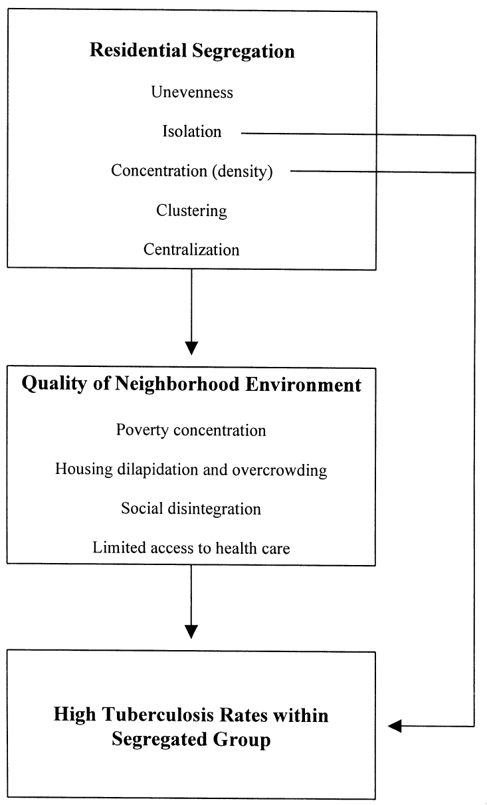
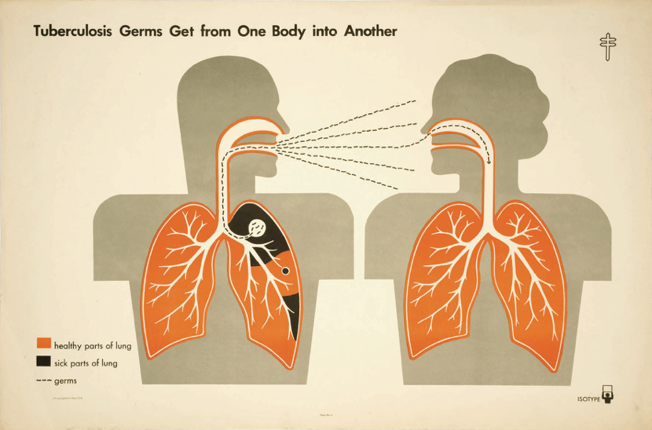
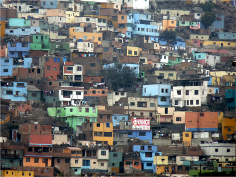
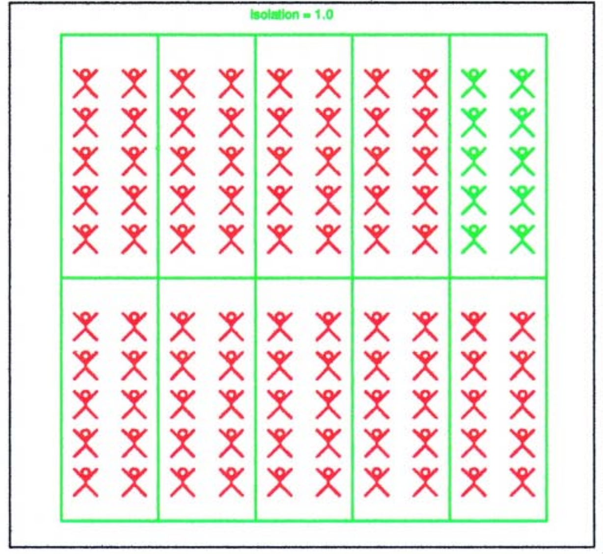
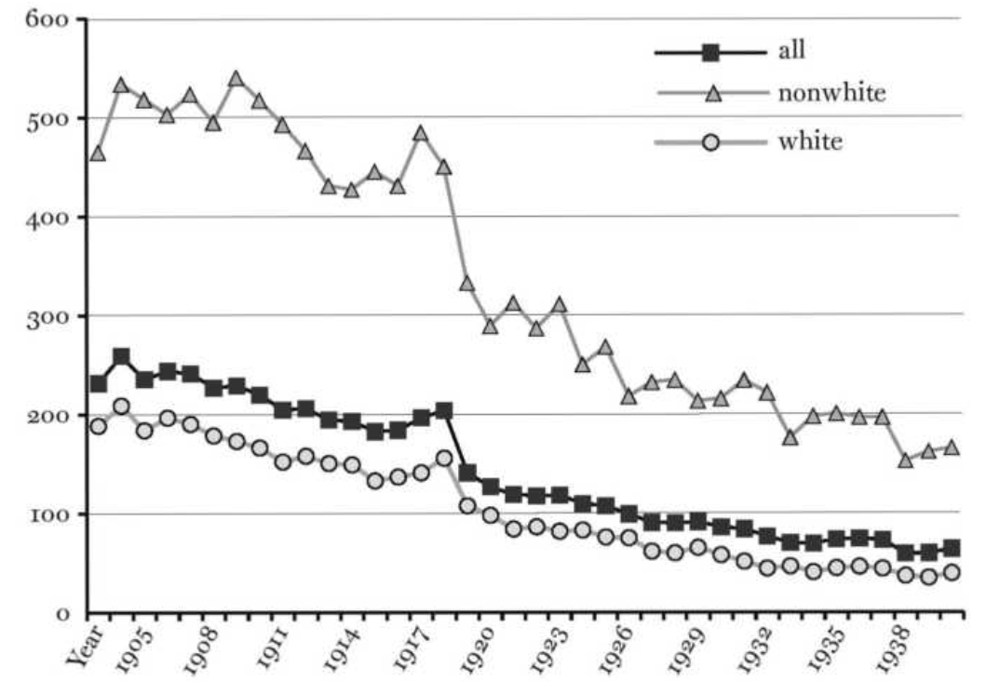
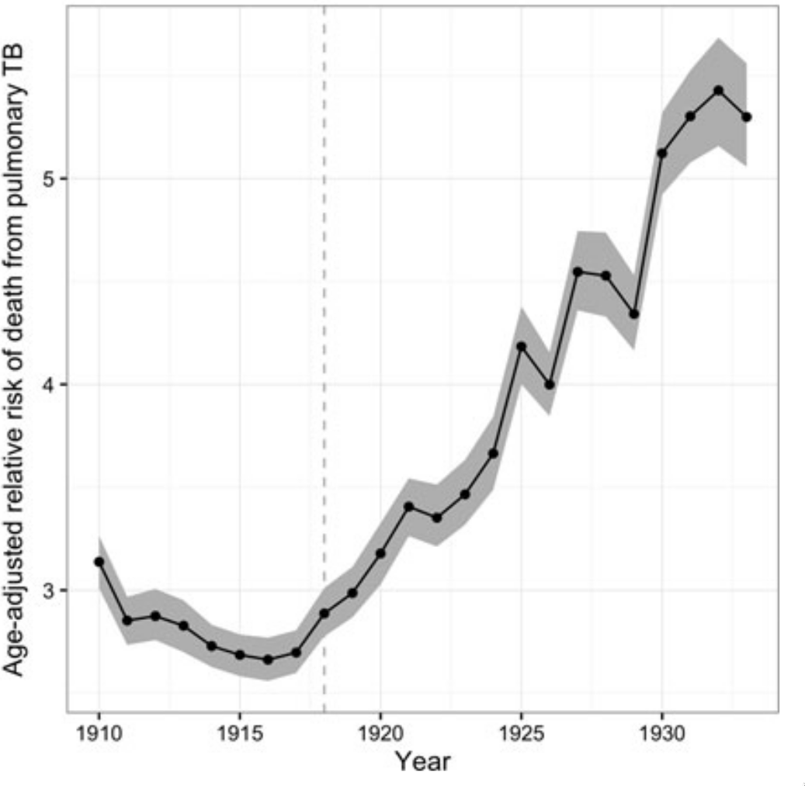
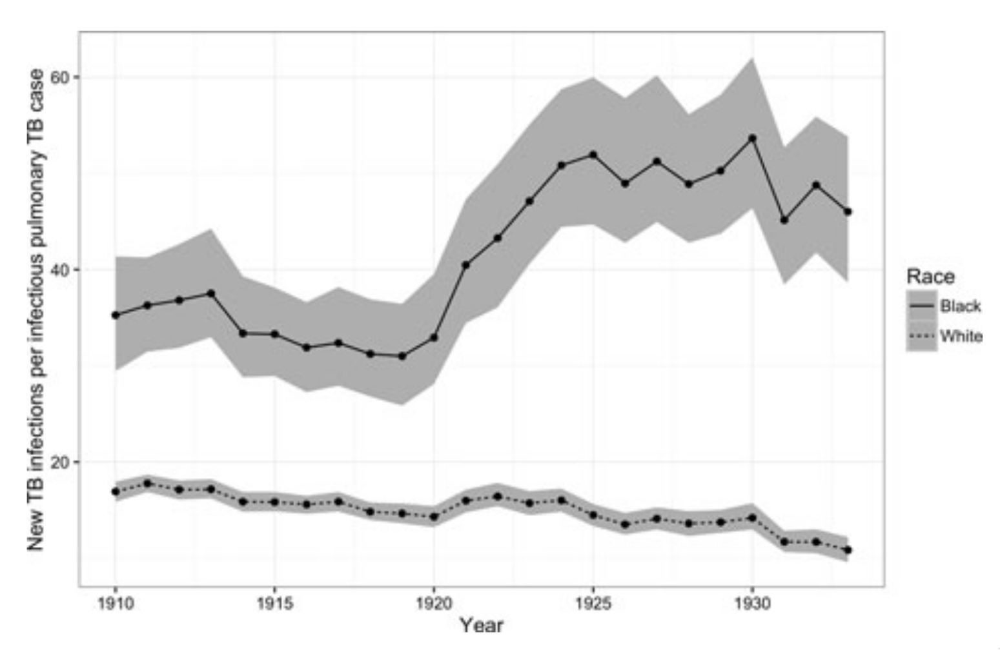

```{r setup, include=FALSE}
require(RefManageR)
require(knitr)
options(htmltools.dir.version = FALSE,
        servr.daemon = TRUE)

knitr::opts_chunk$set(
	echo = FALSE,
	message = FALSE,
	warning = FALSE,
	out.height = 400
)
bib <- ReadBib("~/repos/bibtex-library/jz_library.bib")

cited <- function(citekey){
 return(AutoCite(bib, citekey)) 
}

```

# Agenda

* An overview of measures and mechanisms underlying relationships between segregation and infection risk.

--

* A high-level look at the relationship between MSA-level segregation and STI risk.

--

* Is there a relationship between .alert[eviction] and STI risk?

---

class: inverse center middle

# How does segregation impact TB transmission?

---

background-image: url('images/mtb_sem.jpg')
background-position: 50% 50%
class: inverse

# The star of our show

---


## TB disease has multiple manifestations

- Pulmonary TB is most common, but also:

--

- TB meningitis, i.e. infection of tissue surrounding the brain

--

- Other forms of extrapulmonary TB, such as Potts Disease, which causes disintegraiton of the spine.

---

# Pulmonary TB symptoms

- Cough, resulting in production of thick - and potentially bloody - mucus from the lungs for at least 2 weeks.

--

- Fever/chills/night sweats.

--

- Weight loss/Fatigue/Weakness.

--

- Fatal in ~50% of people if left untreated.

---

# TB Today

-  TB is currently the leading cause of death from infectious disease worldwide.

--

-  ~ 10.5 M new TB cases and 1.5M TB deaths in 2018

--

-  WHO has set an ambitious target of  .alert[80% reduction in TB incidence by 2035].

---

# What .alert[mechanisms] may link segregation and TB transmission?

.pull-left[

* Which segregation metrics are hypothesized to be related to infection risk?

* Which ones are .alert[direct] vs. .alert[indirect]?

* What, if anything, does this imply for intervention?

]

.pull-right[
  
  
  Conceptual model from `r cited("acevedo-garcia2000")`
  
  ]

---

# Biology of TB transmission is ideally suited to reflect patterns of social inequality

.center[



Transmission via respiratory droplets more likely to occur by close contact.

]

---

# TB transmission more likely to occur in crowded, poorly-ventilated locations
.pull-left[


]

.pull-right[


]

.center[ Densely populated, crowded conditions facilitate TB transmission]

---

# TB is a quintessentially .alert[social] pathogen

> "Diseases manifest multiple personalities just as do living creatures and social institutions. The various moods which they display in different circumstances and at any given time .alert[reflect the dominant aspect of the relationship between the disease process and the life of man in society.]" - Rene Dubos, "The White Plague", 1952

---

# Low Isolation $\to$ Less TB?

.center[

 

Example of low isolation (0.1) 

]

---

# Total Isolation $\to$ More TB?

.center[

 

Example of total isolation (1.0) 

]
---

# Is there evidence to back up this idea?

.center[



Wide, persistent TB disparities by race in 20th Century Baltimore (From `r cited("roberts2009")`)

]

---

# TB .alert[disparities] by race increased during First Great Migration

.center[



Figure from `r cited("zelner2017")`

]

---

# These growing disparities may have been driven by diverging .alert[transmission] rates

.center[



Figure from `r cited("zelner2017")`

]
---

class: inverse center middle

# Residential segregation and STI risk

---

# How are segregation .alert[metrics] and STI risk related?

1. What measures of segregation  do `r cited("biello2012")` hypothesize are related to STI risk?

--

2. What is their *mechanistic* interpretation of the relationship between these measures and infection risk?

--

3. What do they find? How does adjusting for each metric impact their findings?

---

# Neighborhood-level STI risks.

- In pairs, draw a .alert[causal diagram] linking the metrics in Biello et al to mechanisms that might drive downstream risks for STIs.

- Search for papers that might provide other potential intermediaries.

- Based on what you find, decide whether or not this is a useful/helpful way of understanding drivers of .alert[spatially-varying] risk.

---
# Next Time

- In-class lab on measuring segregation.

- Read [`r cited("chaix2005")`](https://drive.google.com/open?id=1-J6aeX1YyEEOT8tbdwlc3M2MdnFjDMk3).

---

# References

```{r, results="asis"}
PrintBibliography(bib, start = 1, end = 4, .opts = list(style = "markdown"))
```
---
# References

```{r, results="asis"}
PrintBibliography(bib, start = 5, .opts = list(style = "markdown"))
```
