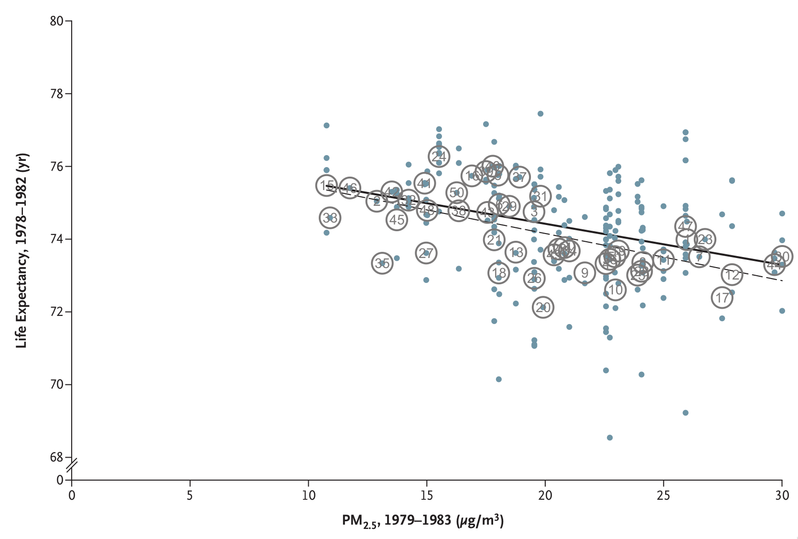
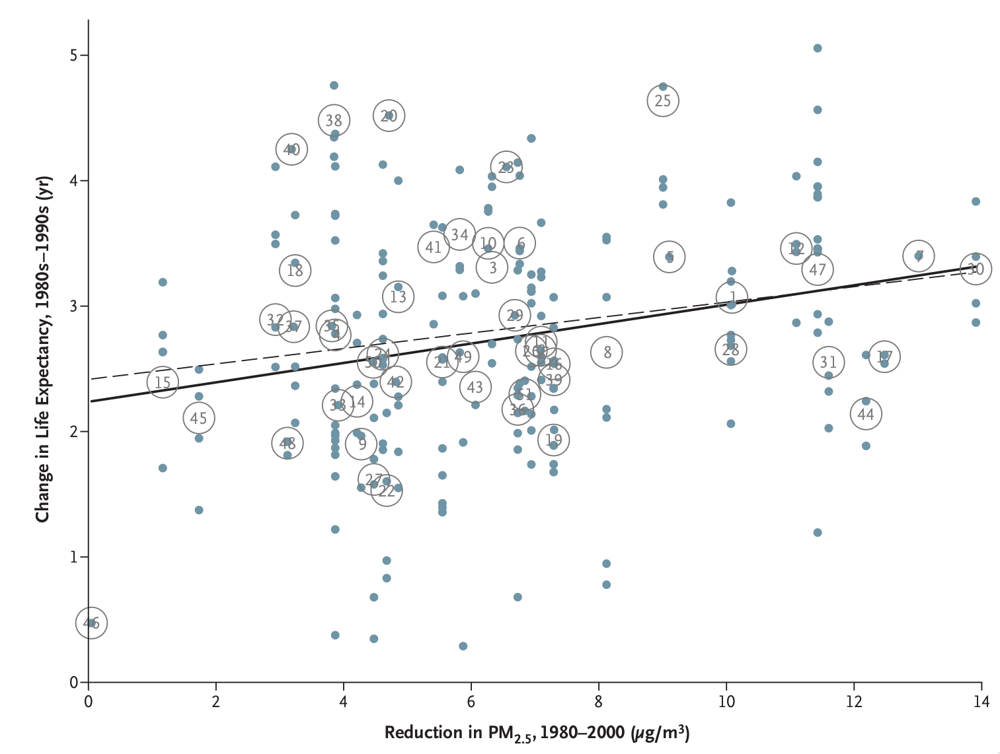
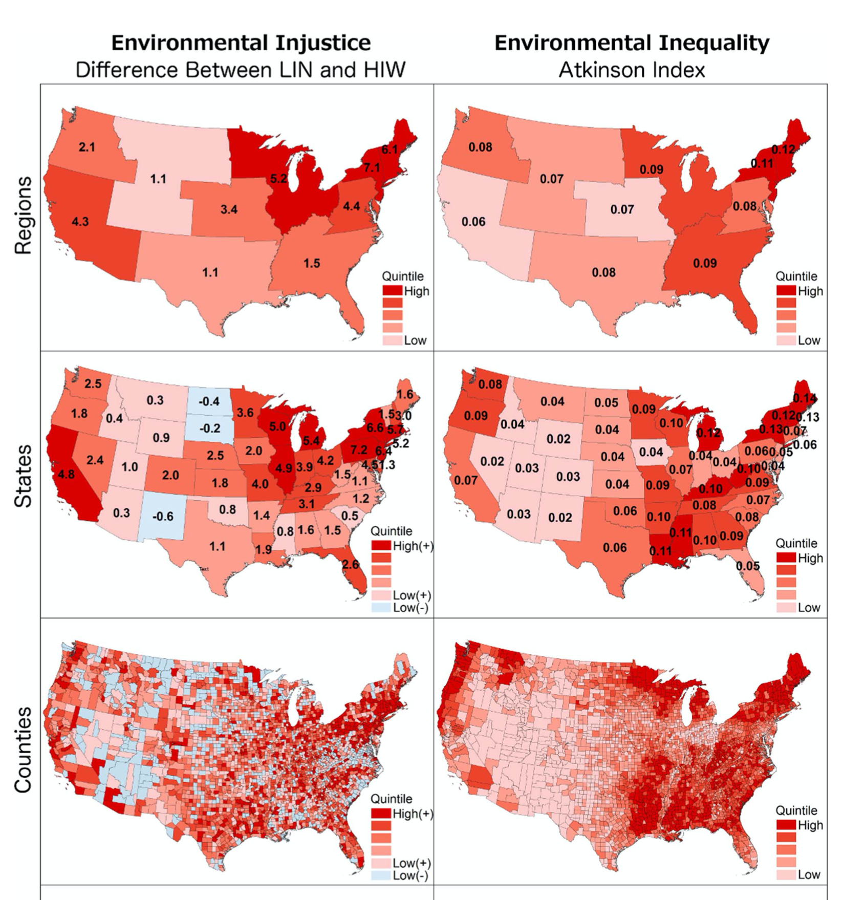
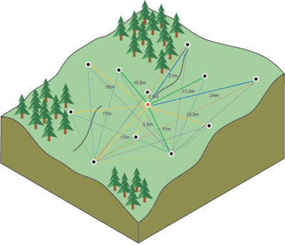
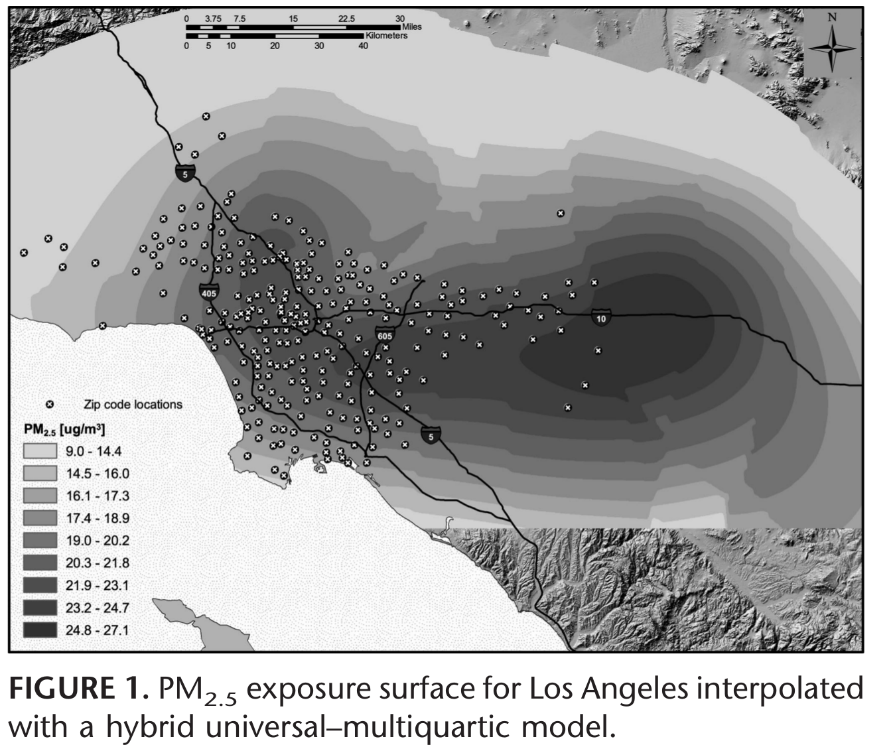
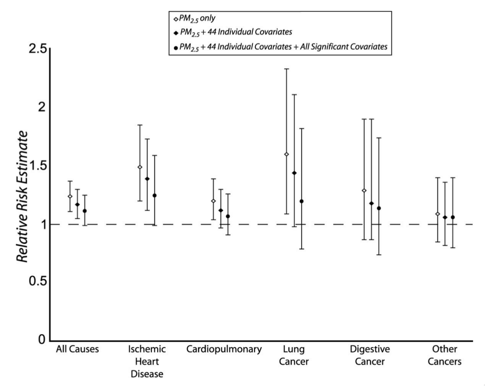

```{r setup, include=FALSE}
require(RefManageR)
require(knitr)
options(htmltools.dir.version = FALSE,
        servr.daemon = TRUE)

knitr::opts_chunk$set(
	echo = FALSE,
	message = FALSE,
	warning = FALSE,
	out.height = 400
)
bib <- ReadBib("~/repos/bibtex-library/jz_library.bib")

cited <- function(citekey){
 return(AutoCite(bib, citekey)) 
}

```

# Agenda

- Preparing for topic proposal presentations.

--

- Regional and local patterns of environmental injustice.

--

- Paper check-ins.

--

- Modeling the impact of .alert[local] air pollution to mortality in Los Angeles.

---

# Project Topic Presentations

- An opportunity to get feedback on the .alert[problem] you are hoping to address.

- Aim for ~10 minute presentation, with time for discussion.

- Prepare 3 questions for the class on areas you are hoping to get assistance with.

- Slides are allowed/welcome, but should have primarily .alert[visual] content.

---

# Fine-particulate air pollution can come from many sources

.center[


Small particles can come from dust or chemical reactions. Their harmfulness comes from their ability to penetrate deeply into the lungs.

]

---

# Clear national impacts of exposure to $PM_{2.5}$ on city-level life expectancy

.center[



Inverse association between city-wide $\text{PM}_{2.5}$ and life-expectancy from `r cited("pope2009")`
]
---

# Cities that reduced $PM_{2.5}$ pollution saw increases in life expectancy

.center[



Positive association, but considerable unexplained variation.

]

---

# National patterns of environmental injustice

1. How do Clark et al. distinguish between environmental .alert[injustice] and .alert[inequality]?

--

2. What kind of data do they use to get at these questions?

--

3. What scales do they focus on? Are their results consistent across scales?

--

4. Would you say their modeling approach is .alert[spatial] or not?

---

# So many scales!


---

class: center middle inverse

# Spatial variation in air-pollution attributable mortality in Los Angeles

---

# The promise and peril of fine-scale modeling

- Analysis of `r cited("pope2009")` and Clark et al. and other similar city-level analyses are important for understanding macro-scale patterns. Why might we want to look at a lower level?

--

- Health effects of air pollution exposure are likely to be greater near sources. 

--

- Linear .alert[dose-response] relationship (more exposure $\to$ more death) means that spatially concentrated exposure may exact a high burden of mortality in local areas that is washed out by averaging over exposure.

--

- In other words, using citywide average pollution exposure may .alert[underestimate] impact of pollution exposure as well as inequality.

---

# Data

- Jerrett at al. used data on 22,905 subjects from the American Cancer Society cohort from 1982-2000.

--

- 5,856 deaths during this period.

--

- Pollution measurements taken from 23 fine particle ($PM_{2.5}$) monitors and 42 ozone ($O_3$) monitors in L.A.

--

- How do we go from 23 measurements to zip-code level measurements in a sprawling metropolis?

---

# Some Questions

1. What are some of the measurement issues posed by their air pollution data?

--

2. Why use a .alert[survival] model?

--

3. How do they determine whether their model has adequately accounted for .alert[spatial clustering] of mortality?

--

4. What's missing from this analysis that you would have liked to see?

---


# Spatial smoothing required to make zip-code level estimates of pollution exposure

.center[


Black points = measured locations, .red[Red] point = predicted value.

Kriging uses the .alert[spatial covariance] between measured points to predict values at unmeasured points

]

---

# Using this model, they interpolated small-particle exposures



---

# Freeway "buffer zones" adjust for potential confounding from traffic exposure not captured by kriging

- Traffic pollution could be another source of air-pollution related mortality risk that is not captured by the $PM_{2.5}$ kriging predictions:

  - Zipcode areas within 500-1000 meters of a freeway.

  - Exposure to traffic pollution may have independent effects at a smaller scale than $PM_{2.5}$ and $0_3$ levels predicted by kriging.

---

# Individual and area-level covariates/confounders

- 44 lifestyle, dietary, demographic, occupational, educational factors

--

- "More than 10 variables that measure aspects of smoking" (!)

--

- Eight ecological/"contextual" variables at zipcode level: average income, income inequality, education, population size, racial composition, and unemployment.

--

- Also include proportion with air conditioning to adjust for possible exposure misclassification

---

# How do the authors deal with the different/conflicting spatial levels in this analysis?

--

- Kriging predictions are in .alert[continuous space], but other exposure/demographic data are at the .alert[zip-code] level.

--

- So: Jerrett et al. take a spatially weighted average of the predicted exposure across grid cells within zip-code areas.

---
name: multisurv

# Multi-level .alert[survival] model used to estimate hazard ratios associated with exposure

---

class: inverse middle center

# A pause for.alert[survival analysis]

---

# A simple example

- 10,000 individuals are enrolled in a study to measure the average mortality rate, $\lambda$, over a 20 year period among indviduals aged > 70 years. 

--

- Here we are assuming time-constant mortality and no covariates.

---

## Individuals who live past end of study period are .alert[survivors]

```{r, echo=FALSE, warning=FALSE, message=FALSE, caption = "Vertical bar indicates end of study period."}
require(ggplot2)

N <- 10000
x <- rexp(N, rate = 1/10)

g <- ggplot(data.frame(x=x), aes(x=x)) + 
  geom_histogram(binwidth = 1) + 
  xlab("Years lived following enrollment in study") + 
  ylab("Number dying at time t past enrollment") +
  geom_vline(xintercept = 20)
plot(g)

```

---

# Recoding the data so that surviors are assigned time T+1

```{r, echo=FALSE, warning=FALSE, message=FALSE}

y <- x
y[y > 20] <- 21

g <- ggplot(data.frame(x=y), aes(x=x)) + 
  geom_histogram(binwidth = 1) + 
  xlab("Years lived following enrollment in study") 
plot(g)

```

---

# Use a survival model to account for the unobserved death times.

- The survivor function, $S(t)=Pr(t<y_i)=exp(-\lambda t)$.

--

- Probability of death at time $t$ = $Pr(y_i=t)=\lambda\exp(-\lambda t)$

--

- Probability of surviving the entire time is $S(20)=exp(-\lambda 20)$


---
class: inverse center middle

# And we're back...

---
template: multisurv

Calculate hazard of death at time $t$ for individual $i$ in zip-code area $j$ as:

 $$\lambda_{ij,s}(t)=\lambda_{0,s}(t)\eta_{j}exp(\beta'x_{ij,s})$$

--

Where:

- $\lambda_{0,s}(t)$ is the baseline hazard for sex/race/age stratum $s$.

--

- $\beta$ is a vector of log-.alert[hazard ratios] associated with individual $i$'s covariates

--

- $\eta_{j}$ is a .alert[shared frailty] term for individuals living in area $j$.

---

# .alert[Shared frailty] term is the relative increase/decrease in hazard of death associated with living in location $j$

- Jerrett et al. use an un-structured .alert[covariance] matrix for random effects.

--

- They assign .alert[first-order] and .alert[second-order] neighbors to each zip-code area using their spatial contiguity, and examine residual spatial autocorrelation using Moran's I.

--

- If important spatial exposures have been accounted for, residual spatial autorcorrelation should be negligible. 

---

class: center

# Results by cause of death and covariates included


Relative risks of death associated with $10{\mu g/m^3}$ increase in $PM_{2.5}$ exposure for different levels of covariate adjustment.

---

# How can we know if this model captures important spatial dimensions of exposure?

--

- Random effect terms, $\eta_j$, reflect .alert[residual] zipcode-level variation not explained by environmental exposures and demographic covariates.

--

- So, if the important exposures are accounted for, there should be no .alert[spatial correlation] in random effects.

--

- Look at .alert[Moran's I] across areas. 

---

# Next Time

- Writing for an audience with Ella August.

- In-class self assessment of 'problem' assignment.

---

# References

```{r, results="asis"}
PrintBibliography(bib, start = 1, end = 4, .opts = list(style = "markdown"))
```
---
# References

```{r, results="asis"}
PrintBibliography(bib, start = 5, .opts = list(style = "markdown"))
```
