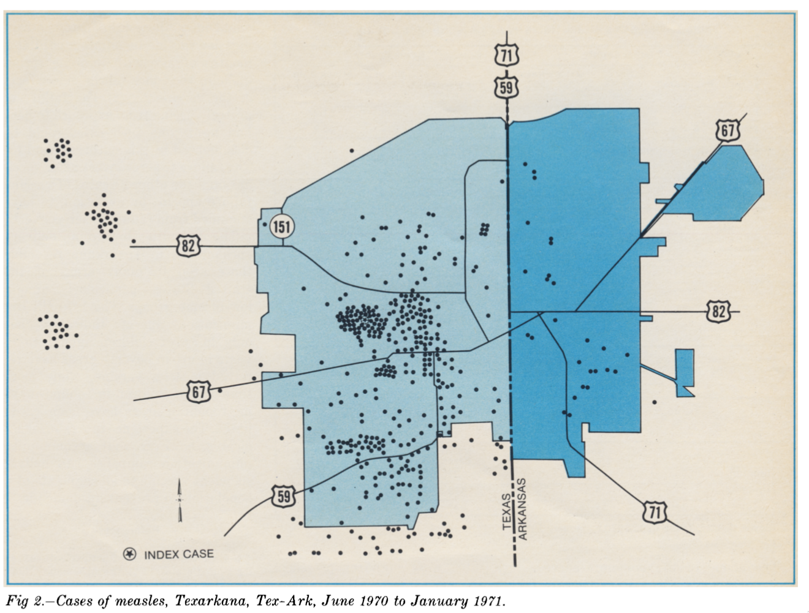

```{r setup, include=FALSE}
require(RefManageR)
require(knitr)
options(htmltools.dir.version = FALSE,
        servr.daemon = TRUE)

knitr::opts_chunk$set(
	echo = FALSE,
	message = FALSE,
	warning = FALSE,
	out.height = 400
)
bib <- ReadBib("~/repos/bibtex-library/jz_library.bib")

cited <- function(citekey){
 return(AutoCite(bib, citekey)) 
}

```

# Agenda

* Why .alert[simulate]?

--

* Hierarchical + Spatial Models!

--

* Return of the hands-on .alert[clustering] activity.

--

---

# Hierarchical + Spatial = ?

1. How did the *level* of measurement of contextual variables impact their results?

2. How can we interpret the residual spatial autocorrelation after the area-level covariates are accounted for?

3. What tools might you use to see if something .alert[systematic] is going on?

---
class: inverse center middle

# Spatial Clustering of Non-Vaccination

---

# Spatial clustering of non-vaccination $\to$ Spatially clustered outbreaks


Example from `r cited("landrigan1972a")` of differential measles risk in Texarkana TX, and Texarkana AR.
---

# Vaccine hestiancy is often spatially clustered


Spatial clustering of non-vaccinated individuals may lead to outbreaks (Figure from `r cited("olive2018")`).
---

# We know this gives rise to spatially clustered outbreaks


---

# Next Time

- Environmental exposures!

--

- Air pollution!

--

- Read [`r cited("jerrett2005a")`](https://drive.google.com/open?id=1-T9DzCeXFcmXpaTED8BrIgBxxm1cU1pr&authuser=jzelner@umich.edu&usp=drive_fs) and [`r cited("clark2014")`](https://drive.google.com/open?id=1-PJLPEYx6V2-ulZXHz3w-hik8fWiJcLB&authuser=jzelner@umich.edu&usp=drive_fs).


---

# References

```{r, results="asis"}
PrintBibliography(bib, start = 1, end = 4, .opts = list(style = "markdown"))
```
---
# References

```{r, results="asis"}
PrintBibliography(bib, start = 5, .opts = list(style = "markdown"))
```
